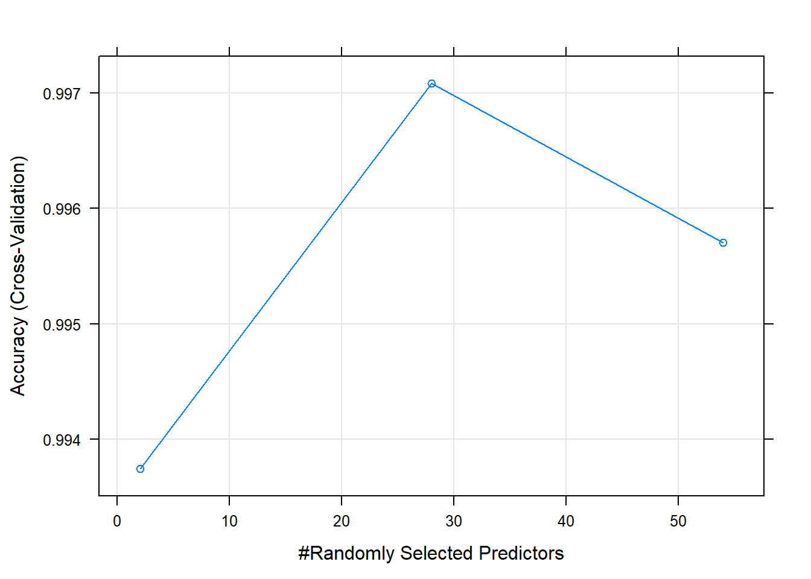

## Intoduction

[Weight Lifting Exercise Dataset](http://groupware.les.inf.puc-rio.br/har) contains data from accelerometers on the belt, forearm, arm, and dumbell of 6 participants. They were asked to perform barbell lifts correctly and incorrectly in 5 different ways. The goal of this project is to use the dataset to predict the manner in which the exercise was performed, this is the `classe` variable in the training set. Two predictive models were built using the measurements of the data to predict `classe` of the exercise.

## Loading Data 

First downloading data, and loading it into train and test data


```r
trainUrl <- "https://d396qusza40orc.cloudfront.net/predmachlearn/pml-training.csv"
testUrl <- "https://d396qusza40orc.cloudfront.net/predmachlearn/pml-testing.csv"

if(!file.exists("pml-training.csv")){
    download.file(trainUrl, "pml-training.csv")
}
if(!file.exists("pml-testing.csv")){
    download.file(testUrl, "pml-testing.csv")
}
```


```r
trainDF <- read.csv("pml-training.csv")
testDF <- read.csv("pml-testing.csv")
```

## Exploratory Analysis

Exploring `classe` feature, the feature to be predicted...


```r
table(trainDF$classe)
```

```
## 
##    A    B    C    D    E 
## 5580 3797 3422 3216 3607
```

So the classe of the exercise contains 5 different fashions:

- (Class A): exactly according to the specification 
- (Class B): throwing the elbows to the front 
- (Class C): lifting the dumbbell only halfway 
- (Class D): lowering the dumbbell only halfway  
- (Class E): throwing the hips to the front

Looking at the dimensions of the data...


```r
dim(trainDF)
```

```
## [1] 19622   160
```

```r
dim(testDF)
```

```
## [1]  20 160
```

the data contains 160 features, let's look at part of them...


```r
str(trainDF[1:30])
```

```
## 'data.frame':	19622 obs. of  30 variables:
##  $ X                   : int  1 2 3 4 5 6 7 8 9 10 ...
##  $ user_name           : Factor w/ 6 levels "adelmo","carlitos",..: 2 2 2 2 2 2 2 2 2 2 ...
##  $ raw_timestamp_part_1: int  1323084231 1323084231 1323084231 1323084232 1323084232 1323084232 1323084232 1323084232 1323084232 1323084232 ...
##  $ raw_timestamp_part_2: int  788290 808298 820366 120339 196328 304277 368296 440390 484323 484434 ...
##  $ cvtd_timestamp      : Factor w/ 20 levels "2/12/2011 13:32",..: 15 15 15 15 15 15 15 15 15 15 ...
##  $ new_window          : Factor w/ 2 levels "no","yes": 1 1 1 1 1 1 1 1 1 1 ...
##  $ num_window          : int  11 11 11 12 12 12 12 12 12 12 ...
##  $ roll_belt           : num  1.41 1.41 1.42 1.48 1.48 1.45 1.42 1.42 1.43 1.45 ...
##  $ pitch_belt          : num  8.07 8.07 8.07 8.05 8.07 8.06 8.09 8.13 8.16 8.17 ...
##  $ yaw_belt            : num  -94.4 -94.4 -94.4 -94.4 -94.4 -94.4 -94.4 -94.4 -94.4 -94.4 ...
##  $ total_accel_belt    : int  3 3 3 3 3 3 3 3 3 3 ...
##  $ kurtosis_roll_belt  : Factor w/ 397 levels "","-0.01685",..: 1 1 1 1 1 1 1 1 1 1 ...
##  $ kurtosis_picth_belt : Factor w/ 317 levels "","-0.021887",..: 1 1 1 1 1 1 1 1 1 1 ...
##  $ kurtosis_yaw_belt   : Factor w/ 2 levels "","#DIV/0!": 1 1 1 1 1 1 1 1 1 1 ...
##  $ skewness_roll_belt  : Factor w/ 395 levels "","-0.003095",..: 1 1 1 1 1 1 1 1 1 1 ...
##  $ skewness_roll_belt.1: Factor w/ 338 levels "","-0.005928",..: 1 1 1 1 1 1 1 1 1 1 ...
##  $ skewness_yaw_belt   : Factor w/ 2 levels "","#DIV/0!": 1 1 1 1 1 1 1 1 1 1 ...
##  $ max_roll_belt       : num  NA NA NA NA NA NA NA NA NA NA ...
##  $ max_picth_belt      : int  NA NA NA NA NA NA NA NA NA NA ...
##  $ max_yaw_belt        : Factor w/ 68 levels "","-0.1","-0.2",..: 1 1 1 1 1 1 1 1 1 1 ...
##  $ min_roll_belt       : num  NA NA NA NA NA NA NA NA NA NA ...
##  $ min_pitch_belt      : int  NA NA NA NA NA NA NA NA NA NA ...
##  $ min_yaw_belt        : Factor w/ 68 levels "","-0.1","-0.2",..: 1 1 1 1 1 1 1 1 1 1 ...
##  $ amplitude_roll_belt : num  NA NA NA NA NA NA NA NA NA NA ...
##  $ amplitude_pitch_belt: int  NA NA NA NA NA NA NA NA NA NA ...
##  $ amplitude_yaw_belt  : Factor w/ 3 levels "","#DIV/0!","0": 1 1 1 1 1 1 1 1 1 1 ...
##  $ var_total_accel_belt: num  NA NA NA NA NA NA NA NA NA NA ...
##  $ avg_roll_belt       : num  NA NA NA NA NA NA NA NA NA NA ...
##  $ stddev_roll_belt    : num  NA NA NA NA NA NA NA NA NA NA ...
##  $ var_roll_belt       : num  NA NA NA NA NA NA NA NA NA NA ...
```

It seems that some features contains alot of NAs, therefore the columns that contains more than 90% NA values were removed, aslo the first 5 columns of the dataset are participants  information like `user_name`, so they were removed as well.


```r
naCols <- which(colSums(is.na(trainDF)|trainDF=="") > 0.9* dim(trainDF)[1])
trainDF <- trainDF[,-c(naCols, 1:5)]
dim(trainDF)
```

```
## [1] 19622    55
```
now the data contains only 55 features, make sure no more NAs...

```r
sum(is.na(trainDF))
```

```
## [1] 0
```
removing same columns from the validation set...

```r
testDF <- testDF[,-c(naCols, 1:5)]
dim(testDF)
```

```
## [1] 20 55
```

## Model Selection

In this section two predictive models were built, Random Forest and Generalized Boosted Regression Models. Since the two models to be built perform feature selection, there's no need to select subset of features previously. Before building the models, train dataset was splitted into 70% training and 30% testing.


```r
library(caret)
```

```
## Loading required package: lattice
```

```
## Loading required package: ggplot2
```

```r
set.seed(1235)
inTrain <- createDataPartition(y=trainDF$classe, p=.7, list = FALSE)
training <- trainDF[inTrain,]
testing <- trainDF[-inTrain,]
dim(training); dim(testing)
```

```
## [1] 13737    55
```

```
## [1] 5885   55
```

### Random Forest

Building random forest model using 6-Fold cross validation...


```r
control <- trainControl(method="cv", number=6)
rfFit <- train(classe~., method="rf", data=training, trControl=control)
rfFit
```

```
## Random Forest 
## 
## 13737 samples
##    54 predictor
##     5 classes: 'A', 'B', 'C', 'D', 'E' 
## 
## No pre-processing
## Resampling: Cross-Validated (6 fold) 
## Summary of sample sizes: 11447, 11448, 11448, 11447, 11447, 11448, ... 
## Resampling results across tuning parameters:
## 
##   mtry  Accuracy   Kappa    
##    2    0.9937393  0.9920802
##   28    0.9970881  0.9963167
##   54    0.9957051  0.9945670
## 
## Accuracy was used to select the optimal model using the largest value.
## The final value used for the model was mtry = 28.
```

The most accurate value for the number of variables available for splitting at each tree node `mtry` was 28 with accuracy 99.7%, after that model accuracy started degrading.


```r
plot(rfFit)
```

<!-- -->

testing the model...


```r
rfPreds <- predict(rfFit, testing)
rfConf <- confusionMatrix(rfPreds, testing$classe)
rfConf$overall[1]
```

```
##  Accuracy 
## 0.9972812
```


```r
rfConf$table
```

```
##           Reference
## Prediction    A    B    C    D    E
##          A 1673    1    0    0    0
##          B    0 1134    6    0    0
##          C    0    4 1020    4    0
##          D    0    0    0  960    0
##          E    1    0    0    0 1082
```

### Generalized Boosted Models (gbm) 


```r
gbmFit <- train(classe~., method="gbm", data = training, verbose=FALSE)
gbmFit
```

```
## Stochastic Gradient Boosting 
## 
## 13737 samples
##    54 predictor
##     5 classes: 'A', 'B', 'C', 'D', 'E' 
## 
## No pre-processing
## Resampling: Bootstrapped (25 reps) 
## Summary of sample sizes: 13737, 13737, 13737, 13737, 13737, 13737, ... 
## Resampling results across tuning parameters:
## 
##   interaction.depth  n.trees  Accuracy   Kappa    
##   1                   50      0.7613898  0.6971207
##   1                  100      0.8293805  0.7839150
##   1                  150      0.8678428  0.8326944
##   2                   50      0.8842639  0.8534146
##   2                  100      0.9386944  0.9224164
##   2                  150      0.9608135  0.9504119
##   3                   50      0.9304579  0.9119513
##   3                  100      0.9682803  0.9598605
##   3                  150      0.9839340  0.9796727
## 
## Tuning parameter 'shrinkage' was held constant at a value of 0.1
## 
## Tuning parameter 'n.minobsinnode' was held constant at a value of 10
## Accuracy was used to select the optimal model using the largest value.
## The final values used for the model were n.trees = 150, interaction.depth =
##  3, shrinkage = 0.1 and n.minobsinnode = 10.
```

The training accuracy of gbm is 98.4%, less than the accuracy of random forset.In addition, the time taken by gbm to train was much larger than time taken by random forest.


```r
plot(gbmFit)
```

<!-- -->

testing the model...


```r
gbmpreds <- predict(gbmFit, testing)
gbmConf <- confusionMatrix(gbmpreds, testing$classe)
gbmConf$overall[1]
```

```
##  Accuracy 
## 0.9870858
```


```r
gbmConf$table
```

```
##           Reference
## Prediction    A    B    C    D    E
##          A 1673   14    0    0    0
##          B    1 1109   13    5    4
##          C    0   16 1008    9    2
##          D    0    0    5  950    7
##          E    0    0    0    0 1069
```


Since **Random Forest** model showed better performance than gbm with accuracy **99.7%** , random forest model was used for the final testing.


```r
results <- predict(rfFit, testDF)
results
```

```
##  [1] B A B A A E D B A A B C B A E E A B B B
## Levels: A B C D E
```


